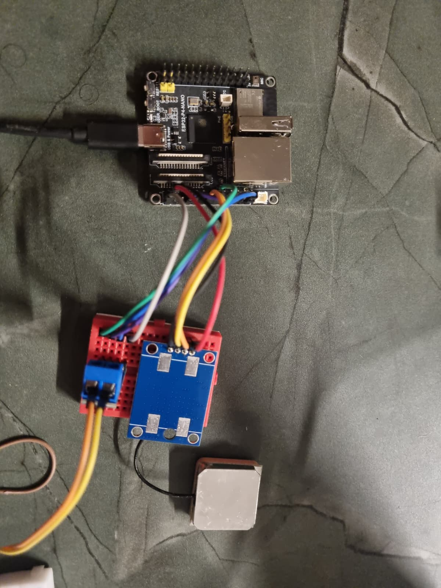

# DriveCost — ESP32-P4

El ESP32-P4 actúa como nodo principal de adquisición y comunicación de **DriveCost**.

Sus funciones son:

- Recibir la posición mediante GPS.
- Recibir el consumo del vehículo mediante CAN.
- Combinar ambos datos en una trama de telemetría.
- Conectarse a la red Wi-Fi.
- Enviar la telemetría al broker mediante MQTT autenticado.

## Instalación



## Esquema de conexiones


## Arquitectura

```text
                        ┌─────────────┐
                        │     GPS     │
                        └──────┬──────┘
                               │ UART
                               ▼
┌─────────────┐ CAN     ┌─────────────┐
│ Arduino Nano│────────►│             │
│  + MCP2515  │         │  ESP32-P4   │
└─────────────┘         │             │
                        └──────┬──────┘
                               │
                            Wi-Fi
                               │
                            MQTT
                               ▼
                        ┌─────────────┐
                        │  Mosquitto  │
                        │   Broker    │
                        └─────────────┘
```

## GPS

El GPS se comunica mediante UART.

### Conexiones

```text
GPS                 ESP32-P4
────────────────────────────
TX   ─────────────► GPIO 21
RX   ◄───────────── GPIO 20
GND  ────────────── GND
VCC  ────────────── alimentación
```

Configuración utilizada:

```cpp
#define GPS_RX_PIN 21
#define GPS_TX_PIN 20
```

La UART funciona a:

```text
9600 baud
8N1
```

El firmware procesa las tramas NMEA:

```text
$GPGGA
$GNGGA
```

y convierte las coordenadas NMEA a grados decimales.

Ejemplo:

```text
GPS: 40.416775,-3.703790
```

## CAN

El ESP32 utiliza su controlador TWAI/CAN junto con un transceptor **SN65HVD230**.

No es necesario utilizar un MCP2515 en el ESP32.

### Conexiones SN65HVD230

```text
SN65HVD230             ESP32-P4
────────────────────────────────
VCC       ──────────── 3.3V
GND       ──────────── GND
CTX / TX  ──────────── GPIO 22
CRX / RX  ──────────── GPIO 23
```

Bus CAN:

```text
SN65HVD230             MCP2515
───────────────────────────────
CANH ═════════════════ CANH
CANL ═════════════════ CANL
GND  ───────────────── GND
```

Configuración:

```cpp
#define CAN_TX_PIN 22
#define CAN_RX_PIN 23
```

Velocidad:

```text
500 kbit/s
```

El ESP32 espera las tramas de consumo en:

```text
CAN ID: 0x100
DLC:    >= 2
```

Los dos primeros bytes contienen el consumo:

```text
Byte 0 = parte alta
Byte 1 = parte baja
```

El valor recibido se reconstruye mediante:

```cpp
uint16_t valor =
    ((uint16_t)mensaje.data[0] << 8) |
    mensaje.data[1];

consumoActual = valor / 100.0;
```

Por ejemplo:

```text
642 → 6.42 L/100km
```

## Terminación CAN

El bus CAN debe tener una resistencia de **120 Ω en cada extremo**.

```text
120 Ω                               120 Ω
 │                                    │
CANH ═══════════════════════════════ CANH
CANL ═══════════════════════════════ CANL
```

Con todo apagado, un multímetro entre CANH y CANL debería medir aproximadamente:

```text
60 Ω
```

## Wi-Fi

Configurar las credenciales en el firmware:

```cpp
const char* WIFI_SSID = "TU_WIFI";
const char* WIFI_PASSWORD = "SistemasDistribuidos2026";
```

Se recomienda no subir credenciales reales al repositorio.

## MQTT

El ESP32 se conecta al broker Mosquitto mediante:

```cpp
const char* MQTT_SERVER = "IP_DEL_BROKER";
const int MQTT_PORT = 1883;

const char* MQTT_USER = "drivecost";
const char* MQTT_PASSWORD = "SistemasDistribuidos2026";
```

Topic utilizado:

```text
drivecost/telemetry
```

## Formato de telemetría

Los datos se publican como JSON:

```json
{
  "latitud": 40.416775,
  "longitud": -3.703790,
  "consumo": 6.42
}
```

La publicación se realiza periódicamente una vez disponible una posición GPS válida.

## Dependencias

El firmware utiliza:

```cpp
#include <Arduino.h>
#include <WiFi.h>
#include <PubSubClient.h>
#include "driver/twai.h"
```

Es necesario instalar **PubSubClient**.

## Monitor serie

Velocidad:

```text
115200 baud
```

Una ejecución normal mostrará:

```text
=== DriveCost ===
CAN iniciado a 500 kbps
WiFi conectado
IP ESP32: 192.168.1.50
Conectando a MQTT... conectado

GPS: 40.416775,-3.703790
Consumo: 6.42 L/100km
MQTT -> {"latitud":40.416775,"longitud":-3.703790,"consumo":6.42}
```

## Seguridad

Actualmente MQTT utiliza autenticación mediante usuario y contraseña.

El puerto `1883` no proporciona cifrado TLS. Para desplegar DriveCost fuera de una red local de confianza se recomienda utilizar MQTT sobre TLS.
