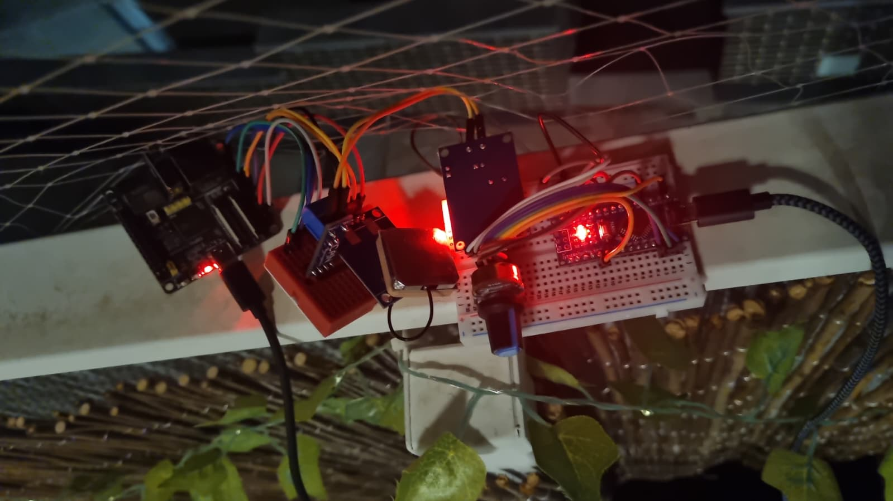

# DriveCost

DriveCost es un sistema distribuido de telemetría vehicular. Un dispositivo instalado en el vehículo publica su **posición GPS** y su **consumo de combustible** mediante MQTT; un servidor combina esa información con los **precios oficiales de los carburantes** en España y muestra, en tiempo real, las gasolineras más cercanas y cuánto costaría recorrer 100 km con el consumo actual.

Proyecto de la asignatura **Sistemas Distribuidos**.



## Índice

1. [Problema a resolver y motivación](#1-problema-a-resolver-y-motivación)
2. [Diseño del sistema](#2-diseño-del-sistema)
   - [2.1. Arquitectura global](#21-arquitectura-global)
   - [2.2. Dispositivos IoT (Arduino Nano y ESP32-P4)](#22-dispositivos-iot-arduino-nano-y-esp32-p4)
   - [2.3. Flujos de Node-RED](#23-flujos-de-node-red)
   - [2.4. Diseño MQTT](#24-diseño-mqtt)
   - [2.5. Dashboard](#25-dashboard)
3. [Semántica de producción y consumo (QoS)](#3-semántica-de-producción-y-consumo-qos)
4. [Patrones de arquitectura orientada a eventos](#4-patrones-de-arquitectura-orientada-a-eventos)
5. [Conclusiones](#5-conclusiones)
6. [Trabajo futuro](#6-trabajo-futuro)
7. [Estructura del repositorio y puesta en marcha](#7-estructura-del-repositorio-y-puesta-en-marcha)

---

## 1. Problema a resolver y motivación

Cuando un conductor busca dónde repostar, normalmente compara el **precio por litro**. Sin embargo, lo que realmente le cuesta un trayecto depende también de **cuánto consume su vehículo** y de **dónde se encuentra**: dos coches distintos no gastan lo mismo con el mismo combustible, y la gasolinera más barata no sirve de nada si está lejos.

La información necesaria para responder a esa pregunta está repartida entre fuentes muy distintas:

| Dato | Dónde está | Cómo se obtiene |
|---|---|---|
| Consumo | En la electrónica del vehículo | Bus CAN |
| Posición | En un receptor GPS | UART (tramas NMEA) |
| Precios | En la API pública del Ministerio | HTTP / JSON |

DriveCost integra estas tres fuentes. El vehículo actúa como **productor** de datos, un broker MQTT los distribuye y un servidor con Node-RED los **consume**, los combina con los precios y presenta el resultado en un dashboard.

### Por qué un sistema distribuido con publish/subscribe

- **El productor está en movimiento y su conectividad no es fiable.** El vehículo se conecta por Wi-Fi y puede perder la conexión en cualquier momento. Necesitamos un mecanismo que detecte esa situación y la comunique al resto del sistema.
- **Productores y consumidores deben estar desacoplados.** El dispositivo del vehículo no debe saber quién usa sus datos. Con publish/subscribe, añadir un nuevo consumidor (un histórico, otro dashboard, una alerta) no requiere modificar el firmware.
- **Los mensajes son pequeños y frecuentes**, y el emisor es un microcontrolador. MQTT está diseñado justo para este caso: es ligero, funciona sobre TCP y dispone de librerías maduras para ESP32.

### Alcance del prototipo

El consumo de combustible **se simula con un potenciómetro**. No disponemos de acceso a un vehículo real durante el desarrollo, y la simulación nos permite reproducir de forma controlada distintos niveles de consumo durante la demostración.

Aun así, el consumo simulado viaja por un **bus CAN real**, que es el mismo tipo de bus por el que circulan los datos de un vehículo. Sustituir el potenciómetro por datos reales de la ECU (por ejemplo, vía OBD-II) no cambiaría el resto de la arquitectura.

Esto nos permite centrar el trabajo en los aspectos propios de la asignatura: generación de eventos, comunicación desacoplada, garantías de entrega, detección de fallos y consumo de los datos desde distintos componentes.

---

## 2. Diseño del sistema

### 2.1. Arquitectura global

#### Diagrama de componentes

```text
┌──────────────────────── VEHÍCULO ────────────────────────┐
│                                                          │
│  Potenciómetro                                           │
│       │ ADC                                              │
│       ▼                                                  │
│  Arduino Nano ──SPI──► MCP2515                           │
│                           │                              │
│                           │ CAN 500 kbit/s (ID 0x100)    │
│                           ▼                              │
│                       SN65HVD230                         │
│                           │ TWAI                         │
│                           ▼                              │
│  GPS NEO-6M ──UART──► ESP32-P4 (gateway)                 │
│                           │                              │
└───────────────────────────┼──────────────────────────────┘
                            │ Wi-Fi · MQTT
                            │ drivecost/telemetry
                            │ drivecost/status (LWT)
┌───────────────────────────┼──────── PC / SERVIDOR ───────┐
│                           ▼                              │
│                    ┌─────────────┐                       │
│                    │  Mosquitto  │                       │
│                    │    :1883    │                       │
│                    └──────┬──────┘                       │
│                           │ suscripciones                │
│                           ▼                              │
│                    ┌─────────────┐      HTTP (15 min)    │
│                    │  Node-RED   │◄───────────────────────────── API precios
│                    └──────┬──────┘                       │      (Ministerio)
│                     ┌─────┴─────┐                        │
│                     ▼           ▼                        │
│                 Dashboard     Mapa                       │
└─────────────────────┬───────────┬────────────────────────┘
                      │ WebSocket │
                      ▼           ▼
                   Navegador del usuario
```

El sistema tiene **dos nodos físicos** que solo se comunican por red a través del broker (el vehículo y el PC), un **servicio externo** (la API de precios) y los **clientes** que abren el dashboard en el navegador.

Mosquitto y Node-RED se ejecutan en el mismo PC por comodidad, pero se comunican por red igual que si estuvieran en máquinas distintas: separarlos solo requiere cambiar la dirección del broker.


#### Flujo de datos extremo a extremo

```text
1. Arduino Nano   Lee el potenciómetro (ADC) y lo convierte a L/100 km.
                  Cada 500 ms envía el consumo en una trama CAN (ID 0x100).

2. ESP32-P4       Recibe la trama CAN y reconstruye el consumo.
                  En paralelo, lee las tramas NMEA del GPS y extrae la posición.

3. ESP32-P4       Cada 1 s compone un JSON con posición y consumo
                  y lo publica en drivecost/telemetry.

4. Mosquitto      Entrega el mensaje a todos los suscriptores del topic
                  y guarda una copia como mensaje retenido.

5. Node-RED       Valida el mensaje, guarda la posición y el consumo,
                  y recalcula las 3 gasolineras más cercanas.

6. Node-RED       Envía el resultado al dashboard y al mapa.

7. Navegador      El dashboard se actualiza sin recargar la página.

En paralelo:
   · Node-RED descarga los precios de la API cada 15 minutos.
   · El ESP32 publica su estado (online) en drivecost/status, y si se
     desconecta de forma inesperada el broker publica offline (Last Will).
```

#### Elección de tecnologías

| Componente | Tecnología | Motivo |
|---|---|---|
| Publish/subscribe | **MQTT 3.1.1** | Protocolo ligero, pensado para dispositivos con pocos recursos y redes poco fiables. Ofrece Last Will, mensajes retenidos y tres niveles de QoS, que cubren las necesidades del proyecto. |
| Broker | **Eclipse Mosquitto** | Broker MQTT de referencia, ligero y fácil de configurar con autenticación. |
| Cliente MQTT del ESP32 | **PubSubClient** | Librería estándar para Arduino/ESP32. |
| Procesamiento | **Node-RED** | Permite construir el procesamiento como un flujo de nodos visible y modificable, e integra MQTT, HTTP y dashboard. |
| Visualización | **Dashboard 2.0** y **Worldmap** | Dashboard web en tiempo real y mapa con marcadores, ambos como nodos de Node-RED. |
| Bus del vehículo | **CAN** | Es el bus que usan los vehículos reales. |

**Por qué MQTT y no Kafka.** Kafka está pensado para grandes volúmenes de eventos con retención y reprocesado, y requiere un clúster de brokers. En DriveCost hay un único productor que envía un mensaje pequeño por segundo desde un microcontrolador, no necesitamos reprocesar el histórico, y Kafka no dispone de un cliente oficial para microcontroladores como el ESP32. MQTT se ajusta mejor a este escenario.

---

### 2.2. Dispositivos IoT (Arduino Nano y ESP32-P4)

El vehículo contiene dos microcontroladores conectados por un bus CAN:

| Dispositivo | Función |
|---|---|
| **Arduino Nano** + MCP2515 | Genera el consumo simulado y lo envía por CAN |
| **ESP32-P4** + SN65HVD230 + GPS NEO-6M | Gateway: combina consumo y posición y los publica por MQTT |

La documentación detallada de cada uno, con esquemas y fotografías, está en [`Hardware/nano_coche`](Hardware/nano_coche/README.md) y [`Hardware/esp32`](Hardware/esp32/README.md).

#### 2.2.1. Arduino Nano: simulador de consumo

El potenciómetro está conectado como divisor de tensión entre 5 V y GND, con el terminal central en el pin `A0`. El ADC de 10 bits del Nano convierte la tensión en un valor entre 0 y 1023, que se escala linealmente a un consumo entre 0 y 20 L/100 km:

```text
consumo (L/100 km) = valorADC × 20 / 1023
```

| ADC | Consumo |
|---:|---:|
| 0 | 0,00 L/100 km |
| 278 | 5,43 L/100 km |
| 512 | 10,01 L/100 km |
| 1023 | 20,00 L/100 km |

El Nano repite la lectura y el envío **cada 500 ms**.

#### 2.2.2. Bus CAN y trama de consumo

Elegimos CAN para comunicar los dos microcontroladores porque es el bus por el que circulan los datos en un vehículo real. Así, el prototipo reproduce la cadena real de adquisición.

```text
Arduino Nano ──SPI──► MCP2515 ══ CANH/CANL ══ SN65HVD230 ──TX/RX──► ESP32-P4 (TWAI)
```

- El Nano no tiene controlador CAN, así que usa un **MCP2515** conectado por SPI.
- El ESP32-P4 tiene un controlador CAN integrado (**TWAI**), y solo necesita el transceptor **SN65HVD230**.
- El bus funciona a **500 kbit/s**, la velocidad habitual del CAN de alta velocidad en automoción.
- El bus lleva una resistencia de **120 Ω en cada extremo**. Con el sistema apagado, entre CANH y CANL deben medirse unos 60 Ω.

**Formato de la trama**

| Campo | Valor | Descripción |
|---|---|---|
| Identificador | `0x100` | Identificador estándar de 11 bits |
| DLC | `2` | Longitud de los datos en bytes |
| Byte 0 | MSB | Byte alto de `consumo × 100` |
| Byte 1 | LSB | Byte bajo de `consumo × 100` |

```text
              CAN ID 0x100 · DLC 2

         Byte 0             Byte 1
      ┌──────────────┬──────────────────┐
      │     MSB      │       LSB        │
      └──────────────┴──────────────────┘
               consumo × 100 (uint16)
```

**Codificación en el Nano**

CAN transporta bytes, no números decimales. Por eso el consumo se convierte en un entero de 16 bits con dos decimales fijos:

```text
ADC = 278
   │  × 20 / 1023
   ▼
5,43 L/100 km
   │  × 100
   ▼
543
   │  hexadecimal
   ▼
0x021F
   │  dos bytes, el más significativo primero
   ▼
data[0] = 0x02   data[1] = 0x1F
```

**Decodificación en el ESP32**

```cpp
uint16_t valor = ((uint16_t)data[0] << 8) | data[1];   // 0x021F = 543
float consumo  = valor / 100.0;                          // 5,43 L/100 km
```

**Por qué un entero con dos decimales fijos y no un `float`.** Un `float` ocupa 4 bytes y obliga a que emisor y receptor interpreten igual su representación interna. Un entero de 16 bits ocupa solo 2 bytes, se decodifica con una operación de desplazamiento y da una resolución de 0,01 L/100 km. Su rango máximo, 655,35 L/100 km, sobra para el rango simulado (como máximo 2000 = `0x07D0`).

**Por qué el identificador 0x100.** En el prototipo es arbitrario. En CAN, el identificador también determina la prioridad en el arbitraje del bus: cuanto más bajo, más prioritario.

#### 2.2.3. ESP32-P4: gateway CAN/GPS → MQTT

El ESP32-P4 es el único dispositivo del vehículo conectado a la red. Sus funciones son:

1. Leer la posición del GPS.
2. Leer el consumo del bus CAN.
3. Componer la telemetría en JSON y publicarla por MQTT cada segundo.
4. Publicar su estado de conexión y registrar el Last Will.
5. Reconectarse automáticamente a la Wi-Fi y al broker.

**Lectura del GPS (tramas NMEA)**

El GPS NEO-6M envía tramas de texto NMEA por UART (9600 baudios, 8N1). El firmware procesa las tramas `$GPGGA` y `$GNGGA`, que contienen la posición y la calidad del fix. Por ejemplo:

```text
$GPGGA,101530.00,4024.3820,N,00342.2736,W,1,07,1.2,650.0,M,51.0,M,,*75
```

| Campo | Valor | Significado |
|---:|---|---|
| 0 | `$GPGGA` | Tipo de trama |
| 1 | `101530.00` | Hora UTC (10:15:30) |
| 2 | `4024.3820` | Latitud en formato `ggmm.mmmm` |
| 3 | `N` | Hemisferio norte |
| 4 | `00342.2736` | Longitud en formato `gggmm.mmmm` |
| 5 | `W` | Hemisferio oeste |
| 6 | `1` | Calidad del fix (0 = sin fix) |
| 7 | `07` | Satélites en uso |

El firmware separa los campos por comas (conservando los vacíos) y descarta la trama si la calidad del fix es `0` o si falta algún campo de posición. Las coordenadas se convierten de grados y minutos a grados decimales:

```text
decimal = grados + minutos / 60        (negativo si S u W)

4024.3820 N  →  40 + 24.3820 / 60  =  40.406367
00342.2736 W → −(3 + 42.2736 / 60) =  −3.704560
```

Hasta obtener el primer fix, el ESP32 utiliza una **posición por defecto** (40.389700, −3.627894). Esto permite probar el sistema en interiores, donde el GPS puede tardar mucho en obtener señal.

**Lectura del CAN**

El controlador TWAI se configura a 500 kbit/s y acepta todas las tramas. El firmware filtra por software las que tienen identificador `0x100` y al menos 2 bytes de datos, y reconstruye el consumo como se ha explicado.

**Publicación de la telemetría**

Cada 1000 ms (usando `millis()`, sin bloquear el bucle principal) el ESP32 compone el mensaje:

```json
{"latitud":40.406367,"longitud":-3.704560,"consumo":5.43}
```

| Campo | Unidad | Precisión |
|---|---|---|
| `latitud` | grados decimales | 6 decimales (~0,1 m) |
| `longitud` | grados decimales | 6 decimales |
| `consumo` | L/100 km | 2 decimales |

Elegimos JSON por ser legible y fácil de procesar en Node-RED. Con unos 60 bytes por mensaje y un mensaje por segundo, el tamaño no es un problema.

**Conexión MQTT**

| Parámetro | Valor |
|---|---|
| Broker | IP del PC, puerto 1883 |
| Autenticación | Usuario y contraseña |
| Client ID | `DriveCost-<MAC>` (fijo) |
| Keep alive | 10 s |
| Last Will | `{"estado":"offline"}` en `drivecost/status`, QoS 1, retenido |

Estas decisiones se justifican en el apartado [2.4](#24-diseño-mqtt).

**Pines utilizados**

| Función | Pin del ESP32-P4 |
|---|---|
| GPS TX → ESP32 RX | GPIO 21 |
| GPS RX ← ESP32 TX | GPIO 20 |
| CAN TX (SN65HVD230) | GPIO 22 |
| CAN RX (SN65HVD230) | GPIO 23 |

---

### 2.3. Flujos de Node-RED

Node-RED actúa como **consumidor** de los datos del vehículo y como **procesador**: valida la telemetría, descarga los precios, calcula las gasolineras recomendadas y alimenta el dashboard. El flujo completo está en [`node-red/flows.json`](node-red/flows.json) y su documentación en [`node-red/README.md`](node-red/README.md).

#### Patrón de procesamiento: estado + recálculo

Las entradas del flujo llegan de forma asíncrona y con frecuencias muy distintas:

| Entrada | Frecuencia |
|---|---|
| Telemetría MQTT | 1 mensaje por segundo |
| Precios de la API | Cada 15 minutos |
| Selector de combustible | Cuando el usuario lo cambia |
| Apertura del mapa | Cuando alguien abre la página |

En lugar de encadenar estas entradas, cada una **guarda su dato en el contexto del flujo** (`flow context`) y dispara el cálculo. El nodo de cálculo lee siempre el estado completo y genera el resultado desde cero:

```text
Telemetría MQTT ────► gps, consumo ───┐
Precios (15 min) ───► estaciones ─────┤
Selector ───────────► combustible ────┼──► Calcular TOP 3 ──┬──► Dashboard
Mapa abierto ───────► (redibujar) ────┘                     └──► Preparar Worldmap ──► Mapa

Estado MQTT ──► Validar estado ──► LED de conexión
```

Esto tiene dos ventajas:

- **El orden de llegada no importa.** Si llega la telemetría antes que los precios, el cálculo informa de que está esperando los precios, y en cuanto llegan se recalcula.
- **El procesamiento es idempotente.** Procesar dos veces el mismo mensaje produce el mismo resultado. Esto es importante para la semántica de entrega (apartado [3](#3-semántica-de-producción-y-consumo-qos)).

El estado del vehículo sigue un camino independiente y no interviene en el cálculo.

#### Nodos principales

| Nodo | Tipo | Función |
|---|---|---|
| `Ubicación MQTT` | mqtt in | Suscripción a `drivecost/telemetry` (QoS 0) |
| `Guardar GPS + consumo` | function | Valida la telemetría y la guarda en el contexto |
| `Estado vehículo (LWT)` | mqtt in | Suscripción a `drivecost/status` (QoS 1) |
| `Validar estado` | function | Acepta solo `online` / `offline` |
| `LED estado vehículo` | ui-template | Indicador de conexión en el dashboard |
| `Precios: inicio + cada 15 min` | inject | Lanza la descarga al desplegar y cada 900 s |
| `API precios carburantes` | http request | Descarga las estaciones y sus precios |
| `Guardar precios en caché` | function | Guarda la lista de estaciones en el contexto |
| `Guardar combustible` | function | Valida y guarda el combustible elegido |
| `Calcular TOP 3` | function | Calcula distancias, selección y costes |
| `Preparar Worldmap` | function | Genera los marcadores y centra el mapa |
| `Mapa TOP 3` | worldmap | Sirve el mapa en `/gasolineras-map` |
| `Dashboard gasolineras` | ui-template | Tarjetas, selector de combustible y mapa incrustado |
| `TEST MQTT DriveCost` | inject | Inyecta una telemetría de prueba sin pasar por el broker |

#### Entrada de telemetría

`Guardar GPS + consumo` convierte el mensaje a objeto y comprueba que:

- es JSON válido;
- la latitud está entre −90 y 90 y la longitud entre −180 y 180;
- el consumo es un número no negativo.

Si alguna comprobación falla, el mensaje se descarta y se registra un error en el panel de depuración. Si es válido, se guarda en el contexto junto con la hora de recepción:

```text
flow.gps = { lat, lon, consumo, ts }
```

#### Precios oficiales

Al desplegar el flujo y después cada 15 minutos, Node-RED descarga la lista de estaciones de servicio de la API REST del Ministerio:

```text
GET https://energia.serviciosmin.gob.es/ServiciosRestCarburantes/PreciosCarburantes/EstacionesTerrestres/
```

La respuesta contiene más de diez mil estaciones (`ListaEESSPrecio`) con su posición, dirección, horario y el precio de cada combustible. Los números vienen con coma decimal (`"1,659"`), que el flujo convierte antes de operar. La lista se guarda en el contexto, de modo que el cálculo no depende de que la API responda en ese momento.

Elegimos 15 minutos porque los precios no varían de un segundo a otro y la respuesta es grande: descargarla con más frecuencia aumentaría el tráfico sin mejorar el resultado.

#### Cálculo del TOP 3

`Calcular TOP 3` se ejecuta cada vez que cambia cualquiera de sus entradas:

1. Calcula la distancia desde el vehículo hasta cada estación con la **fórmula de Haversine**, que da la distancia sobre la superficie terrestre:

   ```text
   a = sin²(Δφ/2) + cos φ₁ · cos φ₂ · sin²(Δλ/2)
   d = 2 · R · atan2(√a, √(1 − a))          R = 6371 km
   ```

2. Ordena las estaciones por distancia y se queda con las **3 más cercanas**.
3. Comprueba si cada una publica precio para el combustible elegido.
4. Si el combustible se vende por litro, calcula el coste de recorrer 100 km:

   ```text
   coste (€/100 km) = consumo (L/100 km) × precio (€/L)

   ejemplo: 8,71 L/100 km × 1,650 €/L = 14,37 €/100 km
   ```

Para los combustibles que se venden por kilogramo (GNC, GNL, hidrógeno) no se calcula el coste, porque el consumo llega en L/100 km y las unidades no son compatibles.

El resultado es un objeto con el estado del cálculo (`ok`, `waiting-gps`, `waiting-prices`…), el combustible elegido y las tres estaciones:

```json
{
  "state": "ok",
  "fuelLabel": "Gasolina 95 (E5)",
  "unit": "€/L",
  "consumoL100": 8.71,
  "top3": [
    {
      "nombre": "REPSOL",
      "direccion": "CALLE EJEMPLO, 1",
      "distanciaKm": 0.35,
      "price": 1.65,
      "costeEuro100": 14.37
    }
  ]
}
```

#### Mapa

`Preparar Worldmap` traduce el resultado en comandos para el mapa: borra las capas anteriores, dibuja un marcador para el vehículo y tres marcadores numerados para las gasolineras (con precio, coste, dirección y horario), y centra la vista en la posición del vehículo.

Cuando alguien abre el mapa, el nodo `Mapa abierto / conectado` fuerza un recálculo para que no aparezca vacío hasta el siguiente mensaje.

#### Estado del vehículo

El estado sigue un camino propio:

```text
drivecost/status ──► Validar estado ──► LED estado vehículo
```

`Validar estado` acepta el JSON del firmware (`{"estado":"online"}`) y descarta cualquier otro valor. El LED no depende del cálculo, así que refleja el estado aunque todavía no haya telemetría ni precios.

---

### 2.4. Diseño MQTT

La configuración completa del broker está en [`mqtt-broker/README.md`](mqtt-broker/README.md).

#### 2.4.1. Broker

Usamos **Eclipse Mosquitto** en el puerto 1883 con la siguiente configuración:

```text
listener 1883
allow_anonymous false
password_file /etc/mosquitto/passwd
```

- **Las conexiones anónimas están deshabilitadas.** Todos los clientes se autentican con usuario y contraseña.
- **La persistencia está activada** (`persistence true`, valor por defecto en Ubuntu), de modo que los mensajes retenidos sobreviven a un reinicio del broker.
- **No usamos TLS.** Las credenciales viajan sin cifrar, lo que es aceptable en una red local de pruebas pero no en un despliegue real (ver [Trabajo futuro](#6-trabajo-futuro)).

#### 2.4.2. Topics: jerarquía y wildcards

| Topic | Publica | Contenido | QoS | Retenido |
|---|---|---|---|---|
| `drivecost/telemetry` | ESP32, cada segundo | Posición y consumo | 0 | Sí |
| `drivecost/status` | ESP32 (`online`) y broker (`offline`) | Estado de conexión | 0 / 1 | Sí |

**Jerarquía.** Los topics siguen el esquema `drivecost/<tipo de dato>`. El primer nivel identifica la aplicación y evita colisiones con otros sistemas que usen el mismo broker; el segundo separa los tipos de información.

**Payloads**

```text
drivecost/telemetry   {"latitud":40.406367,"longitud":-3.704560,"consumo":5.43}

drivecost/status      {"estado":"online"}
                      {"estado":"offline"}
```

**Por qué el estado va en un topic propio y no como un campo de la telemetría**

- **Tienen naturalezas distintas.** La telemetría es un *flujo* (cada muestra sustituye a la anterior); el estado es un *hecho* que cambia pocas veces y que no debe perderse. Por eso necesitan un QoS distinto.
- **El Last Will tiene que ser un mensaje completo en un topic.** El broker publica el `offline` en nombre del ESP32 cuando este ya no puede publicar nada. No puede "añadir un campo" a la telemetría.
- **Cada consumidor se suscribe solo a lo que necesita.** Un componente que solo quiera saber si el vehículo está conectado no tiene que recibir ni procesar una telemetría por segundo.

**Por qué Node-RED usa dos suscripciones exactas y no `drivecost/#`**

- **El filtrado lo hace el broker.** Con dos suscripciones, Mosquitto entrega cada topic al nodo que lo procesa. Con `drivecost/#`, todo llegaría al mismo nodo y habría que separarlo después en Node-RED con un nodo `switch` por topic: el mismo resultado con más lógica.
- **Cada topic se trata de forma distinta.** La telemetría se interpreta como JSON y va al cálculo; el estado va al LED. Son dos caminos independientes desde la entrada.
- **El consumidor solo recibe lo que pide.** Si en el futuro se publica otro topic bajo `drivecost/` (por ejemplo, de depuración), Node-RED no lo recibiría sin necesidad.
- **Encaja con permisos por topic.** Si se añaden ACL en Mosquitto, al usuario de Node-RED se le puede dar lectura solo sobre esos dos topics, en vez de sobre todo el árbol.

Las dos suscripciones comparten el mismo nodo de broker, así que usan **una única conexión** con dos suscripciones, no dos clientes distintos.

Cada suscripción expresa además el QoS que el consumidor acepta para ese dato (0 para la telemetría y 1 para el estado). Con los niveles de publicación actuales, una única suscripción `drivecost/#` con QoS 1 daría el mismo QoS efectivo, ya que siempre se aplica el menor de los dos. No es, por tanto, el motivo principal de la separación, pero sí evita que la telemetría pasara a usar confirmaciones si algún día se publicara con QoS 1.

**Wildcards.** En el sistema actual no son necesarios, porque hay un único vehículo y dos topics. Los usamos solo para depuración:

```bash
mosquitto_sub -h localhost -u drivecost -P 'TU_PASSWORD' -t "drivecost/#" -v
```

La jerarquía está pensada para crecer a varios vehículos insertando un identificador:

```text
drivecost/<id_vehiculo>/telemetry
drivecost/<id_vehiculo>/status
```

En ese caso, Node-RED se suscribiría a `drivecost/+/telemetry` y `drivecost/+/status`. Usaríamos `+` (un nivel) en lugar de `#` (todos los niveles inferiores) por los mismos motivos que antes: cada suscripción recibe solo un tipo de dato.

#### 2.4.3. Mensajes retenidos

Un mensaje retenido es una marca que se añade al publicar: el broker guarda el último mensaje retenido de cada topic y lo entrega inmediatamente a cualquier cliente que se suscriba después.

**Los dos topics son retenidos:**

- **`drivecost/status`.** Es el caso claro de uso: el estado es una información que cualquier consumidor necesita conocer en el momento en que se conecta, sin esperar a que el vehículo cambie de estado. Sin retención, un dashboard abierto después de una caída nunca sabría que el vehículo está desconectado.
- **`drivecost/telemetry`.** Al desplegar el flujo o reiniciar Node-RED, el dashboard muestra la última posición conocida sin esperar a la siguiente muestra.

**El riesgo de retener la telemetría** es que el valor guardado puede ser antiguo: si el vehículo lleva horas apagado, un consumidor recibiría su última posición como si fuera actual.

**Lo resolvemos combinándolo con el estado retenido.** Un consumidor que se conecta recibe a la vez la última telemetría y el último estado. Si el estado es `offline`, sabe que esa telemetría es la última conocida y no la actual. En el dashboard, el LED en rojo indica precisamente eso.

En Node-RED, las dos suscripciones están configuradas para recibir los mensajes retenidos al suscribirse.

Un mensaje retenido se borra publicando un mensaje vacío con la marca de retención:

```bash
mosquitto_pub -h localhost -u drivecost -P 'TU_PASSWORD' -t "drivecost/status" -r -n
```

#### 2.4.4. Last Will & Testament

El **Last Will** es un mensaje que un cliente registra en el broker en el momento de conectarse. El broker lo guarda y lo publica en nombre del cliente **solo si este se desconecta de forma inesperada**, es decir, sin enviar el paquete `DISCONNECT` (porque se queda sin alimentación, pierde la Wi-Fi o deja de responder).

Es el único mecanismo con el que el resto del sistema puede enterarse de que el vehículo ha caído: el propio vehículo ya no puede avisar, así que tiene que hacerlo el broker.

**Configuración**

| Parámetro | Valor |
|---|---|
| Topic | `drivecost/status` |
| Mensaje | `{"estado":"offline"}` |
| QoS | 1 |
| Retenido | Sí |

**Funcionamiento**

```text
Conexión       ESP32 ──CONNECT (Last Will: offline)──► broker   [el broker lo guarda]
               ESP32 ──PUBLISH online (retenido)─────► broker ──► Node-RED: LED verde

Funcionamiento ESP32 ──PUBLISH telemetría (cada 1 s)─► broker ──► Node-RED

Caída          ESP32  ✕  (sin alimentación / sin Wi-Fi)
               ... el broker no recibe nada durante 1,5 × keep alive ...
               broker ──PUBLISH offline (retenido)───► Node-RED: LED rojo

Reconexión     ESP32 ──CONNECT (Last Will: offline)──► broker
               ESP32 ──PUBLISH online (retenido)─────► broker ──► Node-RED: LED verde
```

**Las decisiones que lo acompañan:**

- **El `online` también es retenido.** Al reconectarse, el ESP32 publica `online` para sobrescribir el `offline` retenido. Sin ese mensaje, el estado guardado seguiría siendo `offline` aunque el vehículo hubiera vuelto.
- **Keep alive de 10 s.** El broker considera caído a un cliente que no envía nada durante 1,5 veces su keep alive. Con 10 s, la caída se detecta en unos **15 s**. El valor por defecto de la librería (15 s) tardaría unos 22 s. Un valor menor detecta antes la caída a cambio de enviar más paquetes de control (`PINGREQ`), que son muy pequeños.
- **Client ID fijo, derivado de la MAC** (`DriveCost-<MAC>`). Si el Client ID fuera aleatorio, al reiniciarse el ESP32 se conectaría como un cliente nuevo mientras el broker todavía considera viva la conexión antigua. Al expirar esa conexión, el broker publicaría su `offline` **después** del `online` nuevo, y el estado quedaría como desconectado con el vehículo funcionando. Con un Client ID fijo, el broker cierra la conexión antigua en cuanto se conecta la nueva, y no puede llegar ningún `offline` tardío.

**Lo que el Last Will no detecta.** El Last Will informa de que se ha perdido la **conexión**, no de la calidad de los datos. Si el ESP32 sigue conectado pero el GPS pierde la señal, o deja de llegar la trama CAN, seguirá publicando la última posición o el último consumo conocidos. Detectar esos casos requeriría comprobar la antigüedad de cada dato (ver [Trabajo futuro](#6-trabajo-futuro)).

#### 2.4.5. Sesiones persistentes

Una **sesión persistente** (`clean session = false`) hace que el broker recuerde las suscripciones de un cliente y le **guarde los mensajes de QoS 1 y 2** que lleguen mientras está desconectado, para entregárselos al reconectar.

**En DriveCost, ningún cliente usa sesión persistente** (`clean session = true`), por estos motivos:

- **El ESP32 solo publica, no se suscribe a nada.** La sesión persistente afecta a las suscripciones y a los mensajes que el broker guarda *para* un cliente, así que para un cliente que solo publica con QoS 0 no tiene efecto práctico.
- **La telemetría usa QoS 0, y por defecto el broker no guarda mensajes de QoS 0** para clientes desconectados, aunque la sesión sea persistente. Tampoco querríamos recibirlos: al reconectar, Node-RED recibiría una avalancha de posiciones antiguas.
- **El estado ya llega gracias a la retención.** El único mensaje de QoS 1 es el `offline`. Al suscribirse, Node-RED recibe el último estado retenido, que es lo único que necesita. Con sesión persistente recibiría además todas las transiciones intermedias (`offline`, `online`, `offline`…), que no aportan nada al LED.
- **Simplifica la configuración.** Una sesión persistente obliga a usar un Client ID fijo también en Node-RED y hace que el broker guarde estado por cliente.

Una sesión persistente tendría sentido si existiera un consumidor que necesitara **todos** los eventos, no solo el último. Por ejemplo, un histórico de conexiones y desconexiones del vehículo.

#### 2.4.6. Resumen de clientes

| Cliente | Client ID | Clean session | Keep alive | Publica | Se suscribe |
|---|---|---|---|---|---|
| ESP32-P4 | `DriveCost-<MAC>` | Sí | 10 s | `telemetry` (QoS 0, ret.), `status` (QoS 0, ret.), Last Will (QoS 1, ret.) | — |
| Node-RED | Automático | Sí | 60 s | — | `telemetry` (QoS 0), `status` (QoS 1) |

---

### 2.5. Dashboard

El dashboard está construido con **Dashboard 2.0** (`@flowfuse/node-red-dashboard`) y el mapa con **Worldmap** (`node-red-contrib-web-worldmap`).

```text
Dashboard: http://<servidor>:1880/dashboard/gasolineras
Mapa:      http://<servidor>:1880/gasolineras-map
```

De arriba abajo, muestra:

1. **LED de conexión del vehículo**, alimentado por `drivecost/status`:

   | Color | Texto | Significado |
   |---|---|---|
   | Verde | Vehículo conectado | Último estado recibido: `online` |
   | Rojo | Vehículo desconectado | El broker ha publicado el Last Will |
   | Gris | Vehículo sin datos | Aún no se ha recibido ningún estado |

2. **Consumo actual** recibido por MQTT, en L/100 km.
3. **Selector de combustible** con 23 tipos (gasolinas, diésel, GLP, GNC, hidrógeno…). Al cambiarlo, se recalcula el resultado.
4. **Mensajes de estado del cálculo**, por ejemplo "Esperando MQTT" si todavía no ha llegado telemetría o "Descargando precios oficiales" si la API aún no ha respondido.
5. **Tres tarjetas**, una por gasolinera, con nombre, precio, coste en €/100 km (con la fórmula aplicada), distancia, dirección y horario.
6. **Fecha de los datos oficiales** de precios.
7. **Mapa** con el vehículo y las tres gasolineras numeradas.

El dashboard se actualiza **en tiempo real sin recargar la página**: Dashboard 2.0 mantiene una conexión WebSocket con el navegador y Node-RED le envía cada nuevo resultado. Si se recarga la página, el último resultado se vuelve a enviar automáticamente.

---

## 3. Semántica de producción y consumo (QoS)

MQTT ofrece tres niveles de calidad de servicio, que corresponden a las tres semánticas de entrega:

| QoS | Semántica | Intercambio | Garantía |
|---|---|---|---|
| 0 | **At-most-once** | `PUBLISH` | El mensaje llega una vez o ninguna |
| 1 | **At-least-once** | `PUBLISH` → `PUBACK` | El mensaje llega, pero puede duplicarse |
| 2 | **Exactly-once** | `PUBLISH` → `PUBREC` → `PUBREL` → `PUBCOMP` | El mensaje llega exactamente una vez |

El QoS se aplica por separado en cada tramo: del publicador al broker y del broker a cada suscriptor. El QoS efectivo con el que llega un mensaje al suscriptor es el **menor** entre el de publicación y el de suscripción.

### QoS de cada mensaje

| Mensaje | QoS publicación | QoS suscripción | QoS efectivo | Semántica |
|---|---|---|---|---|
| Telemetría | 0 | 0 | 0 | At-most-once |
| `online` | 0 | 1 | 0 | At-most-once |
| `offline` (Last Will) | 1 | 1 | 1 | At-least-once |

### Telemetría: at-most-once

- **Cada mensaje contiene el estado completo** (posición y consumo), no un cambio respecto al anterior. Perder uno no deja al consumidor en un estado incorrecto: el siguiente lo corrige.
- **Su valor caduca enseguida.** Una posición de hace unos segundos ya no es útil si existe una más reciente, y llega una nueva cada segundo.
- **QoS 1 no aportaría nada y tendría costes.** Añadiría un `PUBACK` por mensaje y la posibilidad de duplicados, y obligaría al ESP32 a guardar cada mensaje hasta recibir su confirmación.

Además, la librería `PubSubClient` del ESP32 **solo permite publicar con QoS 0**, por lo que subir el nivel exigiría cambiar de librería. Lo hemos analizado y, para este tipo de dato, QoS 0 es la elección adecuada de todas formas.

### Estado `offline`: at-least-once

- **No puede perderse.** Un `offline` perdido dejaría el LED en verde con el vehículo caído, que es justo el fallo que el Last Will debe evitar.
- **Un duplicado no tiene efecto.** El LED simplemente vuelve a ponerse en rojo. El consumidor es idempotente.
- **Lo publica el broker**, así que no le afecta la limitación de `PubSubClient`: el QoS del Last Will se declara al conectar y puede ser 1.

### Estado `online`: at-most-once por limitación, mitigado

El `online` lo publica el ESP32, así que solo puede ir con QoS 0. Lo consideramos aceptable porque MQTT funciona sobre TCP: en la práctica, un mensaje de QoS 0 solo se pierde si se cae la conexión, y en ese caso, al reconectar, el ESP32 vuelve a publicar `online`. Además, al ser retenido, cualquier consumidor que se conecte después lo recibe.

### Por qué no usamos QoS 2 (exactly-once)

QoS 2 garantiza que no haya duplicados a cambio de un intercambio de cuatro mensajes. Solo compensa cuando un duplicado tiene consecuencias, como un cobro o una orden que no debe ejecutarse dos veces. En DriveCost, **todos los consumidores son idempotentes**: el cálculo se rehace desde el último estado y el LED se sobrescribe. Un duplicado produce exactamente el mismo resultado, así que QoS 2 solo añadiría latencia y tráfico.

### Garantías en el resto de la cadena

- **CAN:** el propio protocolo incluye confirmación a nivel de enlace (bit ACK) y retransmisión automática de las tramas que no se reciben correctamente.
- **API de precios:** si una descarga falla, Node-RED sigue usando la última lista guardada hasta la siguiente descarga.
- **Dashboard:** si el navegador se desconecta, al reconectar recibe el último resultado.

---

## 4. Patrones de arquitectura orientada a eventos

| Patrón | Dónde se aplica |
|---|---|
| **Publish/subscribe** | Toda la comunicación entre el vehículo y el servidor pasa por el broker. El ESP32 no conoce a los consumidores, y añadir uno nuevo no requiere tocar el firmware. |
| **Event-Carried State Transfer** | Cada mensaje de telemetría transporta el estado completo del vehículo, de modo que los consumidores no necesitan consultar al productor. Es lo que permite tolerar la pérdida de mensajes con QoS 0. |
| **Last Value Cache** | Los mensajes retenidos convierten al broker en una caché del último valor de cada topic, disponible para cualquier consumidor que se conecte tarde. |
| **Detección de presencia** | El Last Will, junto con el `online` retenido, publica la presencia del vehículo como un evento más del sistema. |
| **Estado materializado en el consumidor** | Node-RED mantiene el último valor de cada fuente en el contexto del flujo y recalcula el resultado ante cualquier evento. |

No aplicamos **Event Sourcing**, **CQRS** ni el **patrón Outbox**, porque el sistema no almacena el histórico de eventos ni tiene una base de datos. Tampoco hay **Dead Letter Queue**: los mensajes inválidos se descartan y se registran en el panel de depuración de Node-RED. Enviarlos a un topic `drivecost/dlq` sería una mejora sencilla (ver [Trabajo futuro](#6-trabajo-futuro)).

---

## 5. Conclusiones

### Beneficios

- **Desacoplamiento real entre productor y consumidores.** El vehículo publica sin saber quién consume sus datos. El dashboard, el mapa y el LED se alimentan del mismo broker sin que el firmware cambie.
- **Detección de fallos sin sondeo.** Gracias al Last Will, el sistema se entera en unos 15 segundos de que el vehículo ha desaparecido, sin que Node-RED tenga que preguntarle periódicamente.
- **Estado disponible para quien llega tarde.** Con los mensajes retenidos, un dashboard recién abierto muestra al instante la última posición y el estado de conexión.
- **Garantías de entrega ajustadas a cada dato.** QoS 0 para el flujo de telemetría y QoS 1 para el aviso de desconexión, sin pagar el coste de QoS 2 porque los consumidores son idempotentes.
- **Cadena de adquisición realista.** El consumo viaja por un bus CAN real, por lo que sustituir el potenciómetro por datos del vehículo no cambia la arquitectura.
- **Procesamiento robusto frente al orden de llegada.** El patrón de estado más recálculo en Node-RED funciona independientemente de qué dato llegue primero.

### Limitaciones

- **El consumo es simulado.** Los valores de L/100 km los genera un potenciómetro y no deben interpretarse como medidas reales.
- **La telemetría retenida puede ser antigua.** Lo mitiga el LED de estado, pero un consumidor que ignore `drivecost/status` podría tomar una posición antigua por actual.
- **Posición por defecto.** Hasta obtener el primer fix, el ESP32 publica una posición fija que los consumidores no pueden distinguir de una real.
- **No se comprueba la antigüedad de los datos.** Si el GPS pierde la señal o el bus CAN deja de enviar, el ESP32 sigue publicando el último valor conocido. Antes de recibir la primera trama CAN, el consumo publicado es 0.
- **El broker es un punto único de fallo.** Si Mosquitto cae, el vehículo no puede entregar datos y las muestras de ese periodo se pierden (son QoS 0).
- **Seguridad limitada.** Hay autenticación, pero sin TLS las credenciales viajan sin cifrar, y en el firmware están escritas en el código.
- **Un solo vehículo.** Los topics no incluyen un identificador de vehículo, aunque la jerarquía está preparada para añadirlo.
- **El estado de Node-RED vive en memoria.** El combustible elegido se pierde al reiniciar Node-RED.
- **La recomendación es solo por cercanía.** El TOP 3 se calcula por distancia en línea recta y no tiene en cuenta si compensa desviarse a una estación más barata.

---

## 6. Trabajo futuro

- **Datos reales del vehículo.** Sustituir el potenciómetro por la lectura de la ECU mediante OBD-II, y añadir velocidad, RPM y carga del motor.
- **Varios vehículos.** Pasar a `drivecost/<id_vehiculo>/telemetry` y `drivecost/<id_vehiculo>/status`, con suscripciones `drivecost/+/…` en Node-RED.
- **Validar la antigüedad de los datos.** Marcar el consumo y la posición como no válidos si no se actualizan en un tiempo razonable, y complementar el Last Will con un watchdog en Node-RED que detecte un vehículo conectado que ha dejado de enviar.
- **MQTT 5.** Usar *Message Expiry Interval* para que la telemetría retenida caduque sola, resolviendo el problema de las posiciones antiguas.
- **Recomendación por coste real.** Elegir la gasolinera que minimice el coste total, incluyendo el combustible gastado en el desvío, y usar distancia por carretera.
- **Histórico en una base de datos distribuida.** Almacenar trayectos y precios en una base de datos con réplicas, para calcular estadísticas de consumo y coste por trayecto.
- **Dead Letter Queue.** Publicar los mensajes inválidos en `drivecost/dlq` con el motivo del rechazo, en lugar de descartarlos.
- **Seguridad.** MQTT sobre TLS (puerto 8883), ACL por dispositivo y credenciales fuera del código fuente.
- **Alta disponibilidad del broker.** Usar un clúster o un puente entre brokers para eliminar el punto único de fallo.
- **Contexto persistente en Node-RED**, para conservar la configuración del usuario tras un reinicio.

---

## 7. Estructura del repositorio y puesta en marcha

### Estructura

```text
DriveCost/
├── README.md                    Este documento
├── hardware.jpeg                Fotografía del montaje
├── esquematico hardware.png     Esquema de conexiones completo
│
├── Hardware/
│   ├── nano_coche/              Arduino Nano: simulador de consumo y emisor CAN
│   │   ├── README.md
│   │   └── nano_coche.ino
│   │
│   └── esp32/                   ESP32-P4: gateway CAN/GPS → MQTT
│       ├── README.md
│       └── esp32.ino
│
├── mqtt-broker/                 Instalación y configuración de Mosquitto
│   └── README.md
│
└── node-red/                    Flujo de Node-RED y dashboard
    ├── README.md
    └── flows.json
```

### Puesta en marcha

1. **Broker.** Instalar y configurar Mosquitto con el usuario `drivecost` siguiendo [`mqtt-broker/README.md`](mqtt-broker/README.md).
2. **Node-RED.** Instalar `@flowfuse/node-red-dashboard` y `node-red-contrib-web-worldmap`, importar [`node-red/flows.json`](node-red/flows.json), introducir la contraseña en el nodo `BROKER MQTT` (las credenciales no se exportan con el flujo) y pulsar **Deploy**.
3. **Arduino Nano.** Cargar [`nano_coche.ino`](Hardware/nano_coche/nano_coche.ino) (librería `MCP_CAN_lib`). Comprobar que la frecuencia del cristal del MCP2515 coincide con la del código (`MCP_8MHZ`).
4. **ESP32-P4.** Editar en [`esp32.ino`](Hardware/esp32/esp32.ino) la red Wi-Fi, la IP del PC donde corre Mosquitto y la contraseña MQTT, y cargarlo (librería `PubSubClient`).
5. **Comprobar.** Abrir `http://<servidor>:1880/dashboard/gasolineras`. El LED debe ponerse en verde y, al girar el potenciómetro, debe cambiar el consumo y el coste.

Para observar el tráfico MQTT directamente:

```bash
mosquitto_sub -h localhost -u drivecost -P 'TU_PASSWORD' -t "drivecost/#" -v
```

```text
drivecost/status {"estado":"online"}
drivecost/telemetry {"latitud":40.406367,"longitud":-3.704560,"consumo":5.43}
```

Si el ESP32 se desconecta de la alimentación, unos 15 segundos después debe aparecer `drivecost/status {"estado":"offline"}` y el LED del dashboard debe pasar a rojo.
